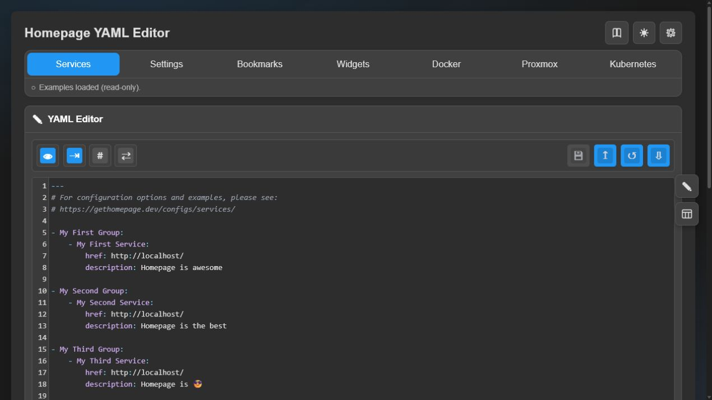
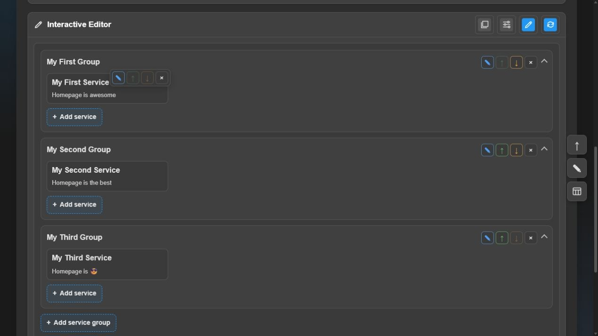

# Homepage YAML Editor

Homepage YAML Editor is a browser-based editor for [Homepage](https://gethomepage.dev/) configuration files. I find it a pain to edit yaml files especially long ones so I designed this to run side by side with homepage. 

Disclaimer this project uses AI to write code and troubleshoot issues.

## Screenshots

### YAML editor



Edit raw YAML with CodeMirror, file tabs, validation, and a live Homepage-style preview.

### Interactive editor



Add, edit, reorder, and remove dashboard groups, services, and bookmarks from the preview.

## Highlights

- Supports `services`, `settings`, `bookmarks`, `widgets`, `docker`, `proxmox`, and `kubernetes` YAML files.
- Preserves the original YAML text, comments, and formatting when files are loaded and saved.
- Provides syntax highlighting, line numbers, auto-indent, comment toggling, validation, and preview-to-source navigation.
- Renders groups, service cards, bookmarks, widgets, icons, layouts, and common Homepage options in the preview.
- Includes an Interactive Editor for adding, editing, moving, drag-reordering, and deleting supported dashboard items; tabbed layouts include direct service-to-group and service-group-to-tab reassignment controls.
- Keeps changes pending until Save, with undo support and a ZIP download for all loaded files.
- Remembers theme, a custom page and browser-tab title, visible tabs, editor preferences, and custom option types.
- Lets custom option types target any combination of services, service groups, bookmarks, and service widgets, with configurable defaults for new items.
- Can be protected with an optional username and password.
- Warns prominently when authentication is disabled and rejects saves when a loaded file changed on disk.

## Installation

### Docker Compose

The recommended setup uses the current [docker-compose.yml](https://github.com/mayoko185/homepage-yaml-editor/blob/main/docker-compose.yml). It runs the official Homepage image and Homepage YAML Editor together:

```sh
git clone https://github.com/mayoko185/homepage-yaml-editor.git
cd homepage-yaml-editor
# Edit the config volume path and HOMEPAGE_ALLOWED_HOSTS in docker-compose.yml if needed
docker compose up -d
```

Open Homepage at `http://server-ip:3000` and the editor at `http://server-ip:8081` (or use `localhost` when browsing from the Docker host).

Both containers mount the same `/opt/stacks/homepage/config` host directory. Homepage sees it at `/app/config`, while the editor sees it at `/hp_config`. Change both volume entries if your Homepage configuration is stored elsewhere, keeping the host-side path identical:

```yaml
services:
  homepage:
    volumes:
      - /path/to/homepage/config:/app/config

  homepage-editor:
    environment:
      - AUTOLOAD_DIR=/hp_config
    volumes:
      - /path/to/homepage/config:/hp_config
```

Use matching `PUID` and `PGID` values so both containers can access the configuration files. Set `HOMEPAGE_ALLOWED_HOSTS` to the hostname or IP address used to open Homepage when accessing it through anything other than localhost. The commented Docker socket mount is optional; configure the required socket permissions before enabling it, or use a Docker socket proxy. Editor-specific settings remain separate in `./data`.

The Compose example publishes the editor on every host interface. When login is disabled, anyone who can reach port `8081` can read or change the mounted Homepage configuration. The editor displays a persistent warning in this state. Restrict the port with a firewall, bind it to `127.0.0.1`, or enable login before exposing it to an untrusted network.

After saving in the editor, Homepage reads the updated files from the shared directory. Some `settings.yaml` changes require using Homepage's refresh control before they appear.

### Docker image

Use the published image directly when you do not need to build locally:

```sh
docker run -d \
  --name homepage-yaml-editor \
  --restart unless-stopped \
  -p 127.0.0.1:8081:8081 \
  -e PUID=1000 \
  -e PGID=1000 \
  -e AUTOLOAD_DIR=/hp_config \
  -v /path/to/homepage/config:/hp_config \
  -v "$PWD/data:/app/data" \
  docker.io/mayoko185/homepage-yaml-editor:latest
```

### Local development

Requires Node.js 20 or newer and pnpm 11.7.0:

```sh
pnpm install --frozen-lockfile
pnpm dev
```

Check dependencies for known vulnerabilities:

```sh
pnpm audit --audit-level=high
# or
pnpm run audit
```

The default Node integration suite does not require a browser. The optional real-browser suite uses Playwright Chromium:

```sh
pnpm exec playwright install chromium
pnpm test:browser
```

The development server listens on <http://localhost:8081>. Set `DATA_DIR`, `AUTOLOAD_DIR`, or `ALLOWED_CONFIG_DIRS` to point it at your Homepage configuration directory.

## Configuration

| Variable | Default | Purpose |
| --- | --- | --- |
| `DATA_DIR` | `/hp_config` | Default directory for Homepage YAML files. |
| `AUTOLOAD_DIR` | unset | Directory to load automatically at startup. |
| `ALLOWED_CONFIG_DIRS` | unset | Comma-separated additional directories allowed for loading and saving. |
| `APP_DATA_DIR` | `/app/data` | Persistent editor settings and option definitions. |
| `DEFAULT_THEME` | `dark` | Initial theme; use `light` for the light theme. Overrides the `theme` default in `app-settings.default.json` when set. |
| `REQUIRE_LOGIN_USER` | unset | Optional login username. Must be paired with `REQUIRE_LOGIN_PASSWORD`. |
| `REQUIRE_LOGIN_PASSWORD` | unset | Optional login password. |
| `TRUST_PROXY` | `false` | Set to `true` only behind a trusted reverse proxy so secure requests and client addresses are detected correctly. |
| `PUID` / `PGID` | `1000` | Container user and group IDs used by the startup script. |

To enable login in Compose, uncomment and change both `REQUIRE_LOGIN_USER` and `REQUIRE_LOGIN_PASSWORD`.

The bundled `app-settings.default.json` seeds the editor defaults (theme, page title, auto-indent, tab visibility and order, etc.) shipped with the image. Edit that JSON file to change the defaults without touching server code; when `DEFAULT_THEME` is set it still overrides the bundled `theme` default. Runtime preferences chosen in the Settings panel continue to be persisted in `settings.json` under `APP_DATA_DIR`.

Login credentials sent over plain HTTP are not encrypted. Use HTTPS through a trusted reverse proxy for remote access, enable `TRUST_PROXY=true` only when direct access to the application port is blocked, and keep the editor off untrusted networks when login is disabled.

## Usage notes

- If no configuration directory is available, the app opens bundled sample YAML files in read-only mode.
- Saving validates YAML first and only writes the supported Homepage filenames.
- Saving uses atomic file replacement and refuses to overwrite a file changed by another process after it was loaded. Reload the directory to review the current disk version while preserving or copying the pending editor content first.
- Loaded directories must be `/hp_config`, `DATA_DIR`, `AUTOLOAD_DIR`, or a path listed in `ALLOWED_CONFIG_DIRS`.
- The Interactive Editor currently focuses on service and bookmark YAML. Raw YAML editing remains available for every supported file.

## License

See the repository for license information.
