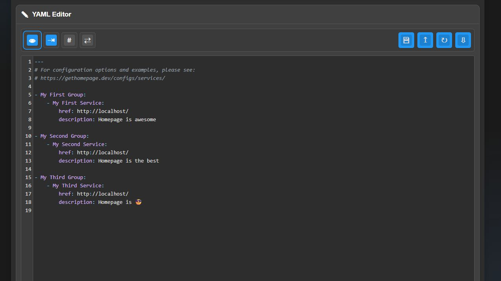
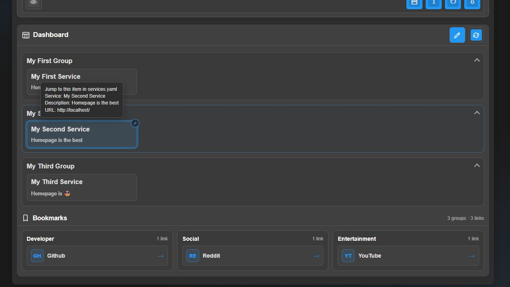
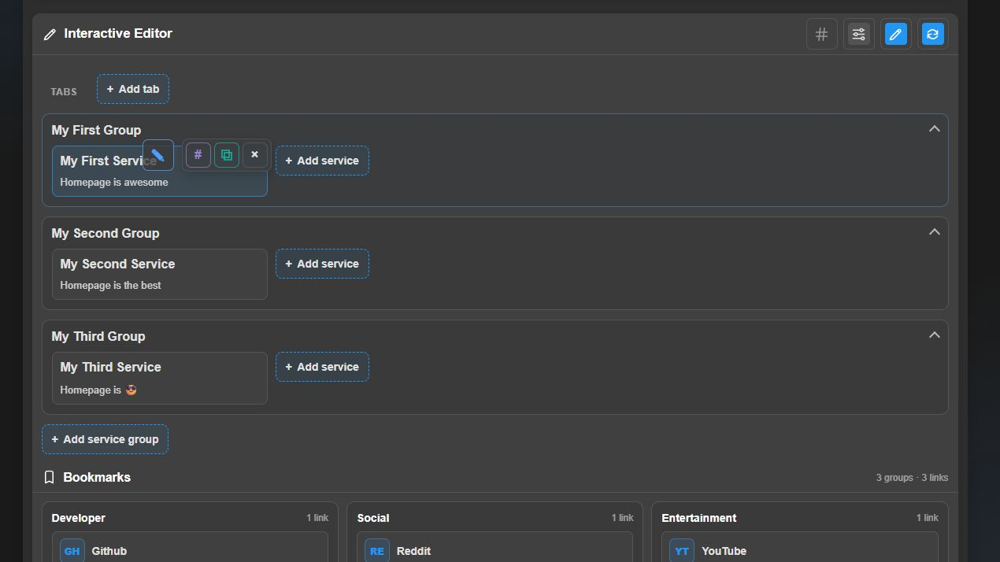

# Homepage YAML Editor

Homepage YAML Editor is a browser-based editor for [Homepage](https://gethomepage.dev/) configuration files. Designed to run alongside Homepage dashboard, edit your YAML with syntax highlighting, validation, a live preview, or an Interactive Editor.

## Screenshots

### YAML editor and live preview



Edit raw YAML with CodeMirror, with the ability to jump between the services and settings YAML while staying in the same service group.

### Live preview



Preview the resulting Homepage layout in the same workspace.

### Interactive Editor with nested groups



Add, edit, move, reorder, and remove supported dashboard items from the preview, including nested service groups.

## Highlights

- Supports `services`, `settings`, `bookmarks`, `widgets`, `docker`, `proxmox`, and `kubernetes` Homepage YAML files.
- Preserves source YAML text, comments, and formatting when files are loaded and saved.
- Provides syntax highlighting, line numbers, auto-indent, comment toggling, validation, and preview-to-source navigation.
- Renders groups, nested groups, service cards, bookmarks, widgets, icons, layouts, and common Homepage options in the preview.
- Provides an Interactive Editor for adding, editing, moving, drag-reordering, commenting, duplicating, and deleting supported dashboard items.
- Supports dashboard tabs, nested service-group creation, cross-group service moves, and direct service/group reassignment from tabbed layouts.
- Keeps edits pending until Save, supports Undo, and can download all loaded files as a ZIP archive.
- Remembers theme, page title, visible tabs, tab order, editor preferences, and custom option types.
- Creates configurable dated backups before overwriting files and refuses to overwrite a file changed on disk after it was loaded.
- Supports optional username/password protection and clearly warns when authentication is disabled.

## Quick start with Docker Compose

The recommended deployment runs Homepage and Homepage YAML Editor together with a shared configuration directory:

```sh
curl -O https://raw.githubusercontent.com/mayoko185/homepage-yaml-editor/refs/heads/main/docker-compose.yml
# Edit the config volume path and HOMEPAGE_ALLOWED_HOSTS in docker-compose.yml if needed
docker compose up -d
```

Open Homepage at `http://server-ip:3000` and the editor at `http://server-ip:8081`.

Both containers must mount the same host directory. Homepage sees it at `/app/config`; the editor sees it at whatever path `HOMEPAGE_CONFIGS` points to (here, `/hp_config`):

```yaml
services:
  homepage:
    volumes:
      - /path/to/homepage/config:/app/config

  homepage-editor:
    environment:
      - HOMEPAGE_CONFIGS=/hp_config
    volumes:
      - /path/to/homepage/config:/hp_config
```

Use matching `PUID` and `PGID` values so both containers can access the files. Set `HOMEPAGE_ALLOWED_HOSTS` to the hostname or IP address used to open Homepage when it is accessed through anything other than localhost. The optional Docker socket mount requires separate socket-permission setup or a Docker socket proxy.

After saving changes, Homepage reads the updated files from the shared directory. Some `settings.yaml` changes require using Homepage's refresh control before they appear.

## Security

The Compose example publishes the editor on every host interface. When login is disabled, anyone who can reach port `8081` can read or change the mounted Homepage configuration. Restrict the port with a firewall, bind it to `127.0.0.1`, or enable login before exposing it to an untrusted network.

Login credentials sent over plain HTTP are not encrypted. Use HTTPS through a trusted reverse proxy for remote access and set `TRUST_PROXY=true` only when direct access to the application port is blocked by that proxy.

To enable login in Compose, set both `REQUIRE_LOGIN_USER` and `REQUIRE_LOGIN_PASSWORD`.

## Other installation options

### Docker image

```sh
docker run -d \
  --name homepage-yaml-editor \
  --restart unless-stopped \
  -p 127.0.0.1:8081:8081 \
  -e PUID=1000 \
  -e PGID=1000 \
  -e HOMEPAGE_CONFIGS=/hp_config \
  -v /path/to/homepage/config:/hp_config \
  -v "$PWD/data:/app/data" \
  docker.io/mayoko185/homepage-yaml-editor:latest
```

### Local development

Requires Node.js 20 or newer and pnpm 11.7.0:

```sh
pnpm install --frozen-lockfile
pnpm dev
```

The development server listens on <http://localhost:8081>. Set `HOMEPAGE_CONFIGS` to point it at your Homepage configuration directory. When unset, bundled sample YAML files load in read-only mode.

## Configuration

| Variable | Default | Purpose |
| --- | --- | --- |
| `HOMEPAGE_CONFIGS` | unset | Directory containing Homepage YAML files. When unset, bundled sample files load in read-only mode. |
| `APP_DATA_DIR` | `/app/data` | Persistent editor settings and option definitions. |
| `DEFAULT_THEME` | `dark` | Initial theme; `light` selects the light theme. Overrides the bundled theme default when set. |
| `REQUIRE_LOGIN_USER` | unset | Optional login username; must be paired with `REQUIRE_LOGIN_PASSWORD`. |
| `REQUIRE_LOGIN_PASSWORD` | unset | Optional login password. |
| `TRUST_PROXY` | `false` | Set to `true` only behind a trusted reverse proxy. |
| `PUID` / `PGID` | `1000` | Container user and group IDs used by the startup script. |

The bundled `defaults/app-settings.default.json` seeds editor defaults such as theme, page title, auto-indent, and tab visibility/order. Runtime preferences are persisted in `settings.json` under `APP_DATA_DIR`.

## Usage notes

- If no configuration directory is available, the app opens bundled sample YAML files in read-only mode.
- Saving validates YAML before writing and only allows the supported Homepage filenames.
- Saves use atomic file replacement and reject stale writes when another process changed a loaded file.
- Loaded directories must be inside the path set in `HOMEPAGE_CONFIGS`.
- Raw YAML editing is available for every supported file. The Interactive Editor focuses on service, bookmark, and dashboard-layout editing.

## Testing and audits

The default integration suite does not require a browser:

```sh
pnpm test
```

Run the optional real-browser suite with Playwright Chromium:

```sh
pnpm exec playwright install chromium
pnpm test:browser
```

Check dependencies for known vulnerabilities:

```sh
pnpm audit --audit-level=high
# or
pnpm run audit
```

## License

See the repository for license information.
